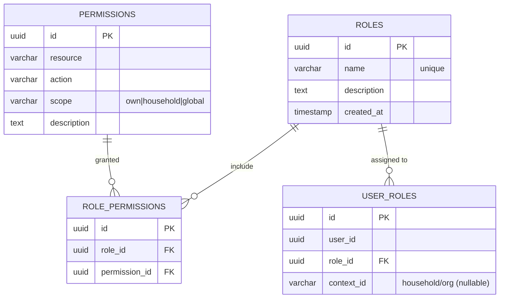

# RBAC Service (Role / Permission / Policy)

```mermaid
erDiagram
  ROLES {
    uuid id PK
    varchar name "unique"
    text description
    timestamp created_at
  }

  PERMISSIONS {
    uuid id PK
    varchar resource
    varchar action
    varchar scope "own|household|global"
    text description
  }

  ROLE_PERMISSIONS {
    uuid id PK
    uuid role_id FK
    uuid permission_id FK
  }

  USER_ROLES {
    uuid id PK
    uuid user_id
    uuid role_id FK
    varchar context_id "household/org (nullable)"
  }

  ROLES ||--o{ ROLE_PERMISSIONS : "include"
  PERMISSIONS ||--o{ ROLE_PERMISSIONS : "granted"
  ROLES ||--o{ USER_ROLES : "assigned to"

```