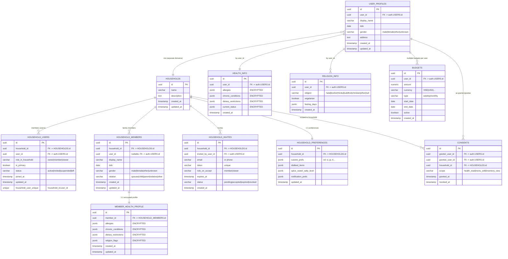

 **Household & Family Members** — hỗ trợ cả thành viên **có tài khoản** lẫn **không có tài khoản** (trẻ em, người lớn tuổi). 
 **ERD Mermaid đầy đủ cho service #3** 

 ### NOTE:
 * Khi lên giai đoạn scale (multi-family, nhiều loại dữ liệu nhạy cảm, chuyên gia dinh dưỡng tham gia) → tách dần thành user-service, health-service, household-service, budget-service.
 * Khúc này Thép suy nghĩ đíu biết làm sao
# README Cấu hình Triển khai User Profile Service

## Lựa chọn cấu trúc service

### Phương án A: Gom lại một service (Khuyến nghị cho MVP)

- **Tên service:** `user-profile-service`
- **Bao gồm các domain/bảng:**  
  - Hồ sơ người dùng (display_name, dob, gender, address, ...)
  - Hộ gia đình (family/group, thành viên)
  - Sức khỏe (allergies, chronic_conditions, dietary_restrictions, ...)
  - Ngân sách (amount, type, period, ...)

**Ưu điểm:**  
- Đơn giản, dễ triển khai nhanh cho MVP.
- Dữ liệu tập trung, dễ truy vấn và quản lý.

**Nhược điểm:**  
- Coupling cao giữa các domain.
- Khó tách nhỏ khi cần mở rộng hoặc chia team.

---

### Phương án B: Chia nhỏ theo domain (Khuyến nghị khi scale)

- **user-service:**  
  - Thông tin cơ bản (display_name, phone, avatar, ...)

- **health-service:**  
  - Dữ liệu sức khỏe nhạy cảm (allergies, chronic_conditions, dietary_restrictions, ...)
  - Bắt buộc mã hóa (encrypt), có audit log.

- **household-service:**  
  - Quản lý hộ gia đình, thành viên, mời, phân vai trò.

- **budget-service:**  
  - Quản lý ngân sách, chi tiêu.

- **consent-service:**  
  - Ủy quyền truy cập dữ liệu health/profile.

**Ưu điểm:**  
- Phân tách rõ ràng, dễ mở rộng, bảo trì, tuân thủ bảo mật.
- Dễ chia team, scale độc lập từng domain.

**Nhược điểm:**  
- Phức tạp hơn khi triển khai, cần giao tiếp giữa các service.
- Phải xử lý đồng bộ dữ liệu và consistency.

---

**Khuyến nghị:**  
- Giai đoạn MVP nên chọn phương án A để phát triển nhanh.
- Khi hệ thống lớn, nhiều dữ liệu nhạy cảm hoặc cần compliance, nên chuyển dần sang phương án B.
---

# 3️⃣ User Profile + Household (mở rộng)

---

## Ghi chú thiết kế (ngắn gọn, thực dụng)

* **Tách PII nhạy cảm**:

  * `HEALTH_INFO` (cho user có tài khoản) và `MEMBER_HEALTH_PROFILE` (cho thành viên không có tài khoản) đều **mã hoá trường** (field-level encryption). Event chỉ mang **ID/flags**.
* **Nhiều mô hình thành viên**:

  * `HOUSEHOLD_USERS`: mapping **user có tài khoản** vào household, có `role_in_household`.
  * `HOUSEHOLD_MEMBERS`: thành viên **có thể không có user\_id** (trẻ em…), vẫn tham gia meal plan.
* **Consent hạt mịn**: `CONSENTS.scope` cho phép ủy quyền (ví dụ Nutritionist được đọc health với consent).
* **Invite flow**: `HOUSEHOLD_INVITES` lưu token + vai trò dự kiến; khi accept → tạo row `HOUSEHOLD_USERS`.
* **Preferences theo household** (không gắn vào user) để planner dùng chung cho cả nhà.
* **Index/Unique khuyến nghị**:

  * `HOUSEHOLD_USERS (household_id, user_id)` unique.
  * `HOUSEHOLD_INVITES (token)` unique + TTL theo `expires_at`.
  * Partial index cho `CONSENTS (grantee_user_id) WHERE revoked_at IS NULL`.

---

